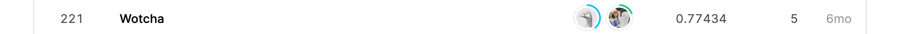

# Introduction
This is a try on SHOPEE 2020 Shopee Code League: [Product Detection](https://www.kaggle.com/c/shopee-product-detection-open/overview)

* Model: 
A pre-trained [RESNET152](https://pytorch.org/docs/stable/_modules/torchvision/models/resnet.html#resnet152) is used to extract features, and a fully-connected network is then added to do the classification. See [model.py](./src/models/model.py) for more details.
* Data-Imbalance technique: Resampling. See [get_dataLoader.py](./src/data/get_dataLoader.py)
* Training setting:
    - Optimizer: SGD/ADAM. (ADAM can achieve to best loss earlier, but no big improvement.)
    - Loss: Cross Entropy
    - Learning rate: 0.0002


# Result
Top 1 score: 0.77434  
Got 222/604 teams on public LeaderBoard  


# Usage

## Requirements
* torch 1.1.0 
* torchvision 0.3.0
* [torchsampler](https://github.com/ufoym/imbalanced-dataset-sampler) 0.1
* numpy
* pandas
* yaml
* shutil


## Train your own model:
1. Change the parameter in `./src/config.yml` if you need to, and set the paths to your path to data.
2. Run train.py:
```
python ./src/train.py
```

## Predict
1. Change the path `MODEL_TO_LOAD` in config.yml to the path you put the trained model.
2. Run `./src/predict.py`:
```
python ./src/predict.py
```


# Reference
* [pytorch models](https://pytorch.org/docs/stable/torchvision/models.html)
* [easy classification tutorial](https://www.learnopencv.com/pytorch-for-beginners-image-classification-using-pre-trained-models/)


* [imbalanced-dataset-sampler for pytorch](https://github.com/ufoym/imbalanced-dataset-sampler)
* [ResNet-152 paper](https://arxiv.org/pdf/1512.03385.pdf)

* pre-trained ResNet-152 model from [TORCHVISION.MODELS](https://pytorch.org/docs/stable/torchvision/models.html). 